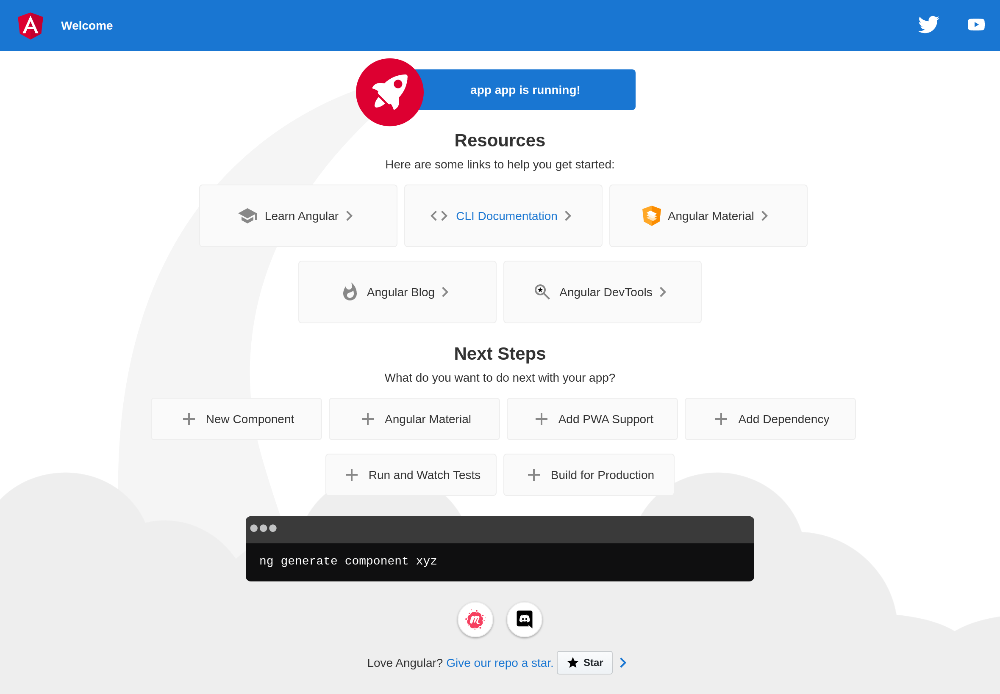
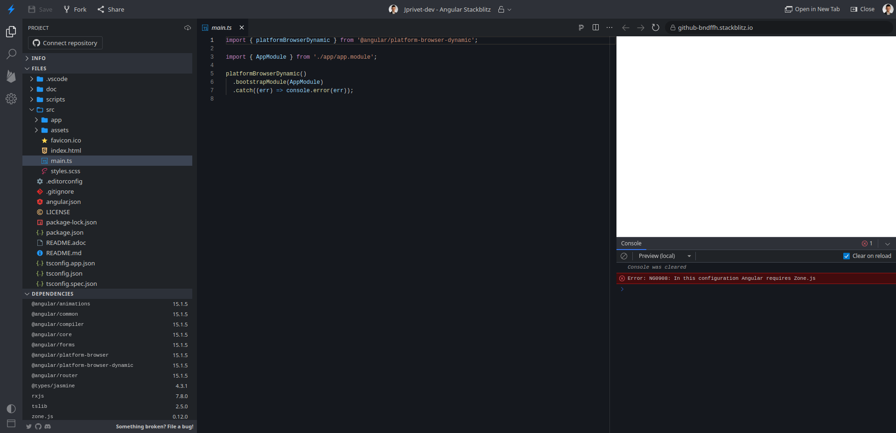
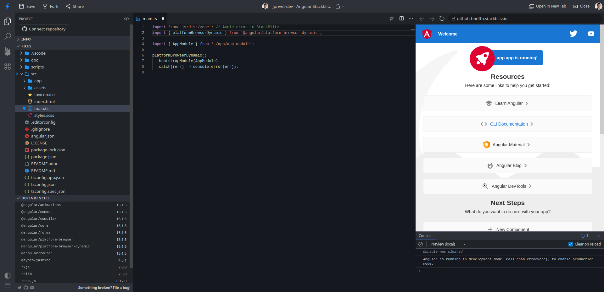

:toc: macro
:toc-title: Summary
:toclevels: 3
:numbered:

ifndef::env-github[:icons: font]
ifdef::env-github[]
:status:
:outfilesuffix: .adoc
:caution-caption: :fire:
:important-caption: :exclamation:
:note-caption: :paperclip:
:tip-caption: :bulb:
:warning-caption: :warning:
endif::[]

:back_to_top_target: top-target
:back_to_top_label: ⬆ Back to top
:back_to_top: <<{back_to_top_target},{back_to_top_label}>>

:main_title: Angular & StackBlitz
:git_project: angular-stackblitz
:git_username: jprivet-dev
:git_url: https://github.com/{git_username}/{git_project}
:git_clone_ssh: git@github.com:{git_username}/{git_project}.git
:stackblitz_from_github: https://stackblitz.com/github/{git_username}/{git_project}/tree/main

// Releases
:project_release: v1.1501.0.1
:node_release: v18.13.0
:npm_release: 8.19.3
:angular_release: 15.1.5

[#{back_to_top_target}]
= {main_title}

image:https://badgen.net/badge/release/{project_release}/blue[Project release,link={git_url}/releases/tag/{project_release}]
image:https://badgen.net/badge/angular/{angular_release}/d93630[Angular release,link=https://github.com/angular/angular/releases/tag/{angular_release}]
image:https://developer.stackblitz.com/img/open_in_stackblitz_small.svg[Open in StackBlitz,link={stackblitz_from_github}]

toc::[]

== Presentation

Sandbox to locally generate a project with Angular CLI and launch it online in StackBlitz.

|===
| Label | Version

| node | {node_release}
| npm | {npm_release}
| Angular | {angular_release}
|===

{back_to_top}

== Prerequisites

=== Install NVM or Node

To lauch locally that project, you will need to install NVM (Node Version Manager) or Node.

[NOTE]
====
More information on:

* NVM: https://github.com/nvm-sh/nvm
* Node: https://nodejs.org/en/download
====

In my case, I used Node in KDE Neon (see https://github.com/nodejs/snap).

{back_to_top}

=== Install a global Angular CLI (optional)

If you want to regenerate a new Angular project, you will need to install/update a global Angular CLI:

```
$ npm install -g @angular/cli
```

NOTE: More information on https://angular.io/cli

{back_to_top}

== Installation

. `$ git clone {git_clone_ssh}`
. `$ cd {git_project}`
. `$ npm install`
. `$ ng serve`
. Open your browser on http://localhost:4200/



{back_to_top}

== StackBlitz

=== Launching the project

image:https://developer.stackblitz.com/img/open_in_stackblitz.svg[Open in StackBlitz,link={stackblitz_from_github}]

NOTE: More information on https://developer.stackblitz.com/guides/integration/open-from-github

{back_to_top}

=== Avoid error with `zone.js`

Angular CLI generates the following file without `zone.js`:

.main.ts
```typescript
import { platformBrowserDynamic } from '@angular/platform-browser-dynamic';

import { AppModule } from './app/app.module';

platformBrowserDynamic().bootstrapModule(AppModule)
  .catch(err => console.error(err));
```

Locally everything works fine with `$ ng serve`, but this creates the following error in StackBlitz:

```
Error: NG0908: In this configuration Angular requires Zone.js
```



So to fix this, we have to import `zone.js` in `main.ts`:

.main.ts
```typescript
import 'zone.js/dist/zone'; // Avoid error in StackBlitz
import { platformBrowserDynamic } from '@angular/platform-browser-dynamic';

import { AppModule } from './app/app.module';

platformBrowserDynamic().bootstrapModule(AppModule)
  .catch(err => console.error(err));
```



NOTE: More information on https://github.com/manfredsteyer/ngx-build-plus/issues/4#issuecomment-613988290

{back_to_top}

== Semantic Versioning

NOTE: Based on https://semver.org/

```
v[MAJOR].[ANGULAR_VERSION].[MINOR].[PATCH]

With [ANGULAR_VERSION] = [ANGULAR MAJOR + ANGULAR MINOR]
```

Example, with `v1` of this repository with `Angular 15.1.6`:

```
v1.1501.0.0
```

{back_to_top}

== Comments, suggestions?

Feel free to make comments/suggestions to me in the {git_url}/issues[Git issues section].

{back_to_top}

== License

"{main_title}" is released under the {git_url}/blob/main/LICENSE[*MIT License*]

---

{back_to_top}
